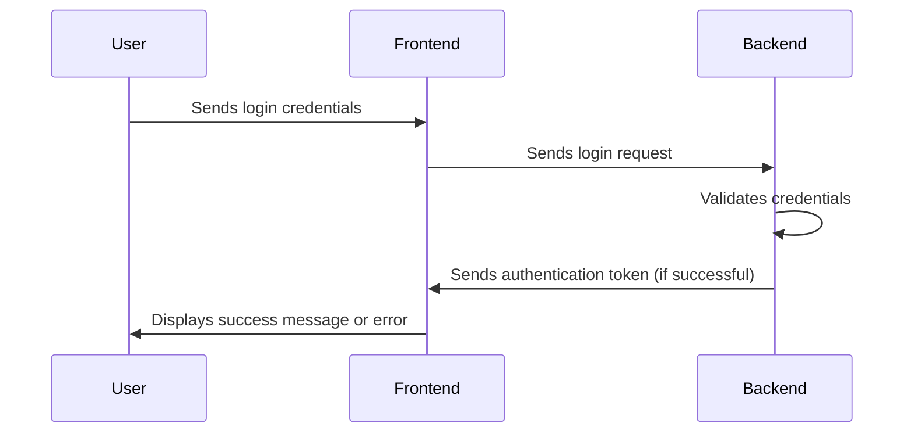
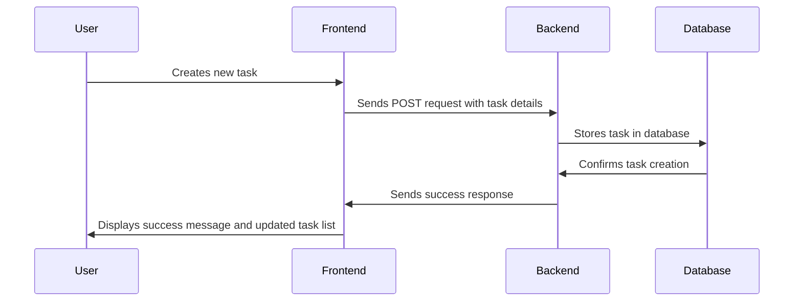
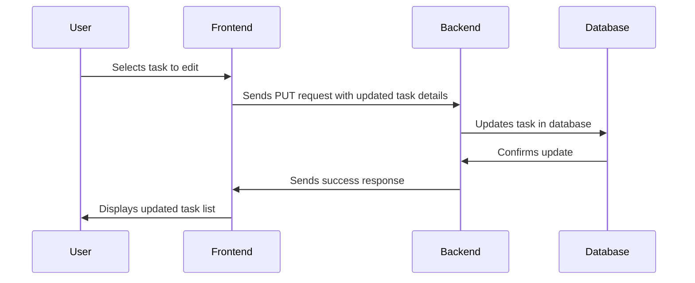
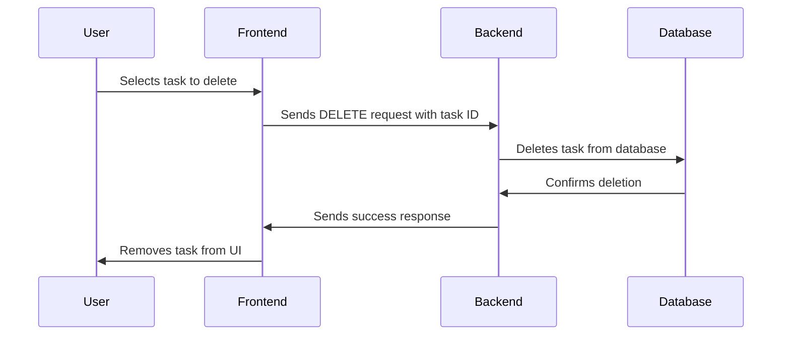

## Sequence Diagrams for the Todo App

### User Login Sequence Diagram:

### User Task Creation Sequence Diagram:

### User Task Update Sequence Diagram:

### User Task Deletion Sequence Diagram:

**Note:** These are simplified sequence diagrams. In a real-world application, you might have additional steps like error handling, data validation, and security checks. You can also add more detailed interactions, such as database queries and network requests.

By creating sequence diagrams, you can visualize the flow of interactions between different components of your system and identify potential bottlenecks or areas for improvement.

