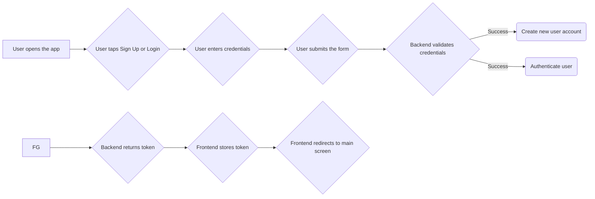
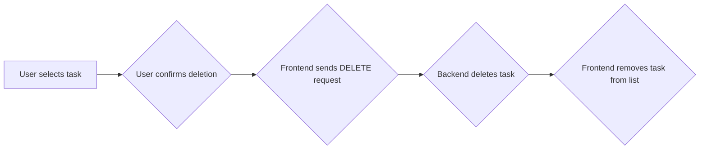

## User Flow Diagrams with Mermaid

**Typora supports Mermaid diagrams, which allow us to visualize user flows. Here's how to represent the user flows you described:**

**User Flow: Sign Up and Login**



**User Flow: Create a Task**

```mermaid
graph LR
A[User navigates to task creation] --> B{User enters task details}
B --> C{User taps "Create Task"}
C --> D{Frontend sends POST request}
D --> E{Backend validates request}
E -->|Success| F(Create new task)
F --> G{Backend returns new task}
G --> H{Frontend displays new task}
```

**User Flow: Edit a Task**

```mermaid
graph LR
A[User taps on existing task] --> B{Frontend displays edit form}
B --> C{User edits task details}
C --> D{User taps "Save"}
D --> E{Frontend sends PUT request}
E --> F{Backend updates task}
F --> G{Frontend updates task list}
```

**User Flow: Delete a Task**



**User Flow: Sync Tasks**

```mermaid
graph LR
A[User opens the app] --> B{Frontend fetches task list}
B --> C{Frontend displays task list}
C --> D{User edits a task (optional)}
D --> E{Frontend sends update request}
E --> F{Backend updates task & notifies clients}
F --> G{Other clients receive updated list}
```

**Remember to replace the placeholders within the curly braces `{}` with your specific descriptions.**

These diagrams provide a visual representation of the user's interaction with the app at each stage. You can further customize these diagrams with different styles and colors using Mermaid syntax.
